```mermaid
flowchart TB
    subgraph upstream["Dependants (1)"]
        P1["<b>📦&nbsp;bradjolicoeur.web.csproj</b><br/><small>net9.0</small>"]
        click P1 "#bradjolicoeurwebbradjolicoeurwebcsproj"
    end
    subgraph current["bradjolicoeur.core.csproj"]
        MAIN["<b>📦&nbsp;bradjolicoeur.core.csproj</b><br/><small>net9.0</small>"]
        click MAIN "#bradjolicoeurcorebradjolicoeurcorecsproj"
    end
    P1 --> MAIN

```

```mermaid
flowchart TB
    subgraph current["bradjolicoeur.web.csproj"]
        MAIN["<b>📦&nbsp;bradjolicoeur.web.csproj</b><br/><small>net9.0</small>"]
        click MAIN "#bradjolicoeurwebbradjolicoeurwebcsproj"
    end
    subgraph downstream["Dependencies (1"]
        P2["<b>📦&nbsp;bradjolicoeur.core.csproj</b><br/><small>net9.0</small>"]
        click P2 "#bradjolicoeurcorebradjolicoeurcorecsproj"
    end
    MAIN --> P2

```

# Projects and dependencies analysis

This document provides a comprehensive overview of the projects and their dependencies in the context of upgrading to .NETCoreApp,Version=v10.0.

## Table of Contents

- [Executive Summary](#executive-Summary)
  - [Highlevel Metrics](#highlevel-metrics)
  - [Projects Compatibility](#projects-compatibility)
  - [Package Compatibility](#package-compatibility)
  - [API Compatibility](#api-compatibility)
- [Aggregate NuGet packages details](#aggregate-nuget-packages-details)
- [Top API Migration Challenges](#top-api-migration-challenges)
  - [Technologies and Features](#technologies-and-features)
  - [Most Frequent API Issues](#most-frequent-api-issues)
- [Projects Relationship Graph](#projects-relationship-graph)
- [Project Details](#project-details)

  - [bradjolicoeur.core\bradjolicoeur.core.csproj](#bradjolicoeurcorebradjolicoeurcorecsproj)
  - [bradjolicoeur.web\bradjolicoeur.web.csproj](#bradjolicoeurwebbradjolicoeurwebcsproj)

## Executive Summary

### Highlevel Metrics

| Metric | Count | Status |
| :--- | :---: | :--- |
| Total Projects | 2 | All require upgrade |
| Total NuGet Packages | 17 | 9 need upgrade |
| Total Code Files | 44 |  |
| Total Code Files with Incidents | 6 |  |
| Total Lines of Code | 1472 |  |
| Total Number of Issues | 610 |  |
| Estimated LOC to modify | 598+ | at least 40.6% of codebase |

### Projects Compatibility

| Project | Target Framework | Difficulty | Package Issues | API Issues | Est. LOC Impact | Description |
| :--- | :---: | :---: | :---: | :---: | :---: | :--- |
| [bradjolicoeur.core\bradjolicoeur.core.csproj](#bradjolicoeurcorebradjolicoeurcorecsproj) | net9.0 | 🟢 Low | 4 | 589 | 589+ | ClassLibrary, Sdk Style = True |
| [bradjolicoeur.web\bradjolicoeur.web.csproj](#bradjolicoeurwebbradjolicoeurwebcsproj) | net9.0 | 🟢 Low | 6 | 9 | 9+ | AspNetCore, Sdk Style = True |

### Package Compatibility

| Status | Count | Percentage |
| :--- | :---: | :---: |
| ✅ Compatible | 8 | 47.1% |
| ⚠️ Incompatible | 1 | 5.9% |
| 🔄 Upgrade Recommended | 8 | 47.1% |
| ***Total NuGet Packages*** | ***17*** | ***100%*** |

### API Compatibility

| Category | Count | Impact |
| :--- | :---: | :--- |
| 🔴 Binary Incompatible | 2 | High - Require code changes |
| 🟡 Source Incompatible | 1 | Medium - Needs re-compilation and potential conflicting API error fixing |
| 🔵 Behavioral change | 595 | Low - Behavioral changes that may require testing at runtime |
| ✅ Compatible | 12609 |  |
| ***Total APIs Analyzed*** | ***13207*** |  |

## Aggregate NuGet packages details

| Package | Current Version | Suggested Version | Projects | Description |
| :--- | :---: | :---: | :--- | :--- |
| FluentCache.Microsoft.Extensions.Caching.Memory | 4.0.0.2 |  | [bradjolicoeur.core.csproj](#bradjolicoeurcorebradjolicoeurcorecsproj) [bradjolicoeur.web.csproj](#bradjolicoeurwebbradjolicoeurwebcsproj) | ✅Compatible |
| LazyCache | 2.4.0 |  | [bradjolicoeur.core.csproj](#bradjolicoeurcorebradjolicoeurcorecsproj) | ✅Compatible |
| LazyCache.AspNetCore | 2.4.0 |  | [bradjolicoeur.web.csproj](#bradjolicoeurwebbradjolicoeurwebcsproj) | ✅Compatible |
| Markdig | 0.38.0 |  | [bradjolicoeur.web.csproj](#bradjolicoeurwebbradjolicoeurwebcsproj) | ✅Compatible |
| Microsoft.AspNetCore.Components | 9.0.0 | 10.0.1 | [bradjolicoeur.web.csproj](#bradjolicoeurwebbradjolicoeurwebcsproj) | NuGet package upgrade is recommended |
| Microsoft.AspNetCore.Razor.Language | 6.0.36 |  | [bradjolicoeur.web.csproj](#bradjolicoeurwebbradjolicoeurwebcsproj) | NuGet package functionality is included with framework reference |
| Microsoft.Extensions.ApiDescription.Client | 9.0.0 | 10.0.1 | [bradjolicoeur.core.csproj](#bradjolicoeurcorebradjolicoeurcorecsproj) | NuGet package upgrade is recommended |
| Microsoft.Extensions.Configuration.Abstractions | 9.0.0 | 10.0.1 | [bradjolicoeur.core.csproj](#bradjolicoeurcorebradjolicoeurcorecsproj) | NuGet package upgrade is recommended |
| Microsoft.Extensions.Configuration.UserSecrets | 9.0.0 | 10.0.1 | [bradjolicoeur.core.csproj](#bradjolicoeurcorebradjolicoeurcorecsproj) | NuGet package upgrade is recommended |
| Microsoft.Extensions.DependencyInjection | 9.0.0 | 10.0.1 | [bradjolicoeur.web.csproj](#bradjolicoeurwebbradjolicoeurwebcsproj) | NuGet package upgrade is recommended |
| Microsoft.VisualStudio.Azure.Containers.Tools.Targets | 1.21.0 |  | [bradjolicoeur.web.csproj](#bradjolicoeurwebbradjolicoeurwebcsproj) | ⚠️NuGet package is incompatible |
| Microsoft.VisualStudio.Web.CodeGeneration.Design | 9.0.0 | 10.0.1 | [bradjolicoeur.web.csproj](#bradjolicoeurwebbradjolicoeurwebcsproj) | NuGet package upgrade is recommended |
| Newtonsoft.Json | 13.0.3 | 13.0.4 | [bradjolicoeur.core.csproj](#bradjolicoeurcorebradjolicoeurcorecsproj) | NuGet package upgrade is recommended |
| NSwag.ApiDescription.Client | 14.2.0 |  | [bradjolicoeur.core.csproj](#bradjolicoeurcorebradjolicoeurcorecsproj) | ✅Compatible |
| System.Reactive | 6.0.1 |  | [bradjolicoeur.core.csproj](#bradjolicoeurcorebradjolicoeurcorecsproj) | ✅Compatible |
| System.Text.Json | 9.0.0 | 10.0.1 | [bradjolicoeur.web.csproj](#bradjolicoeurwebbradjolicoeurwebcsproj) | NuGet package upgrade is recommended |
| WebEssentials.AspNetCore.PWA | 1.0.85 |  | [bradjolicoeur.web.csproj](#bradjolicoeurwebbradjolicoeurwebcsproj) | ✅Compatible |

## Top API Migration Challenges

### Technologies and Features

| Technology | Issues | Percentage | Migration Path |
| :--- | :---: | :---: | :--- |

### Most Frequent API Issues

| API | Count | Percentage | Category |
| :--- | :---: | :---: | :--- |
| T:System.Net.Http.HttpContent | 323 | 54.0% | Behavioral Change |
| T:System.Uri | 223 | 37.3% | Behavioral Change |
| M:System.Uri.#ctor(System.String,System.UriKind) | 44 | 7.4% | Behavioral Change |
| M:System.Uri.#ctor(System.String) | 2 | 0.3% | Behavioral Change |
| M:System.Net.Http.HttpContent.ReadAsStreamAsync | 1 | 0.2% | Behavioral Change |
| M:System.Uri.EscapeUriString(System.String) | 1 | 0.2% | Source Incompatible |
| M:Microsoft.AspNetCore.Builder.ForwardedHeadersExtensions.UseForwardedHeaders(Microsoft.AspNetCore.Builder.IApplicationBuilder,Microsoft.AspNetCore.Builder.ForwardedHeadersOptions) | 1 | 0.2% | Behavioral Change |
| M:Microsoft.AspNetCore.Builder.ExceptionHandlerExtensions.UseExceptionHandler(Microsoft.AspNetCore.Builder.IApplicationBuilder,System.String) | 1 | 0.2% | Behavioral Change |
| T:Microsoft.Extensions.DependencyInjection.ServiceCollectionExtensions | 1 | 0.2% | Binary Incompatible |
| M:Microsoft.Extensions.DependencyInjection.OptionsConfigurationServiceCollectionExtensions.Configure''1(Microsoft.Extensions.DependencyInjection.IServiceCollection,Microsoft.Extensions.Configuration.IConfiguration) | 1 | 0.2% | Binary Incompatible |

## Projects Relationship Graph

Legend:
📦 SDK-style project
⚙️ Classic project

```mermaid
flowchart LR
    P1["<b>📦&nbsp;bradjolicoeur.web.csproj</b><br/><small>net9.0</small>"]
    P2["<b>📦&nbsp;bradjolicoeur.core.csproj</b><br/><small>net9.0</small>"]
    P1 --> P2
    click P1 "#bradjolicoeurwebbradjolicoeurwebcsproj"
    click P2 "#bradjolicoeurcorebradjolicoeurcorecsproj"

```

## Project Details

### bradjolicoeur.core\bradjolicoeur.core.csproj

#### Project Info

- **Current Target Framework:** net9.0
- **Proposed Target Framework:** net10.0
- **SDK-style**: True
- **Project Kind:** ClassLibrary
- **Dependencies**: 0
- **Dependants**: 1
- **Number of Files**: 12
- **Number of Files with Incidents**: 3
- **Lines of Code**: 292
- **Estimated LOC to modify**: 589+ (at least 201.7% of the project)

#### Dependency Graph

Legend:
📦 SDK-style project
⚙️ Classic project

### API Compatibility

| Category | Count | Impact |
| :--- | :---: | :--- |
| 🔴 Binary Incompatible | 0 | High - Require code changes |
| 🟡 Source Incompatible | 1 | Medium - Needs re-compilation and potential conflicting API error fixing |
| 🔵 Behavioral change | 588 | Low - Behavioral changes that may require testing at runtime |
| ✅ Compatible | 7884 |  |
| ***Total APIs Analyzed*** | ***8473*** |  |

### bradjolicoeur.web\bradjolicoeur.web.csproj

#### Project Info

- **Current Target Framework:** net9.0
- **Proposed Target Framework:** net10.0
- **SDK-style**: True
- **Project Kind:** AspNetCore
- **Dependencies**: 1
- **Dependants**: 0
- **Number of Files**: 62
- **Number of Files with Incidents**: 3
- **Lines of Code**: 1180
- **Estimated LOC to modify**: 9+ (at least 0.8% of the project)

#### Dependency Graph

Legend:
📦 SDK-style project
⚙️ Classic project

### API Compatibility

| Category | Count | Impact |
| :--- | :---: | :--- |
| 🔴 Binary Incompatible | 2 | High - Require code changes |
| 🟡 Source Incompatible | 0 | Medium - Needs re-compilation and potential conflicting API error fixing |
| 🔵 Behavioral change | 7 | Low - Behavioral changes that may require testing at runtime |
| ✅ Compatible | 4725 |  |
| ***Total APIs Analyzed*** | ***4734*** |  |

